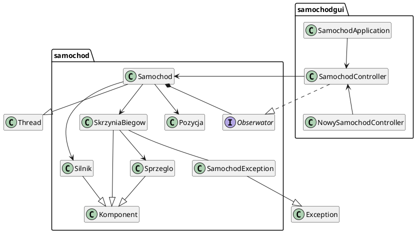
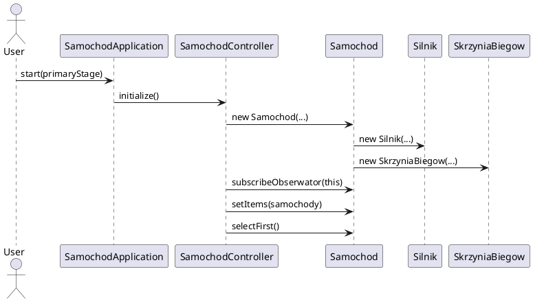
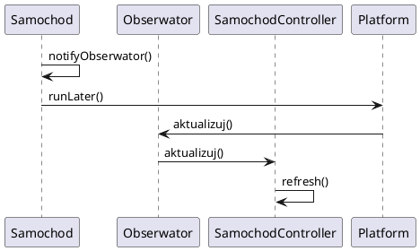
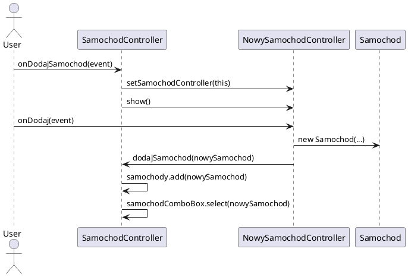

# po2025
Repozytorium dla przedmiotu Programowanie Obiektowe.


Projekt laboratoryjny Samochod (symulacja) - GUI
===============================================

Diagramy UML
------------

### Diagram klas



### Diagram sekwencji



### Diagram sekwencji aktualizacji



### Diagram sekwencji dodania samochodu



### Diagram sekwencji usuwania samochodu

```plantuml
@startuml
actor User
participant SamochodController

User -> SamochodController: onUsunSamochod(event)
SamochodController -> SamochodController: samochody.remove(samochod)
SamochodController -> SamochodController: samochodComboBox.selectFirst()
@enduml
